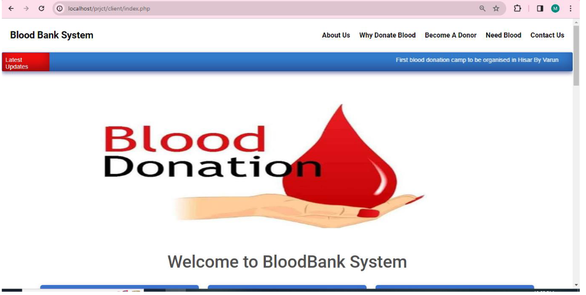
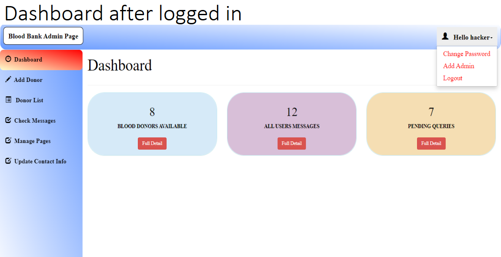

# BloodBank.github.io
<b>Blood Bank System</b>:
    Designed and implemented a web-based system using HTML, CSS, Bootstrap, PHP, MySQL, and AJAX  
    Managed blood donation activities including donor registration, blood inventory, and scheduling 
Client:
    can request a blood donation
    can send a message to the admin
    can request to become a donor
    
 Admin:
     can add, update or delete any page info in the client side
     can view total number of pending messages, all messages and blood donors available
     can add, update or delete and info related to donors, and can accept messages from users or delete them

You can View the pdf to see some photos of the project
